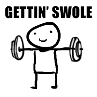

# Hi there  

My name is Le Tien Son

  - 🇻🇳 I'm Vietnamese
  - ❣ <a href="https://www.notion.so/Lee-Tien-Son-84a165483b864862a8fea60ee87bb624"> More about me! </a>
  - 🔭 I'm currently working at <a href="https://seniorautomationtest.com/">SATTEAM</a> 
  - 😄 Pronouns: Son
  - ⚡ Fun fact: I really want to find a new working environment

<h3 align="center"> 💬 Contact me <a  align="center" href="https://letienson987.github.io/contactme/">here</a>  </h3>

 &nbsp;&nbsp;&nbsp;&nbsp;
 &nbsp;   

### <table >
<tr align="center" >
  <td width="400px">
    
  </td>  
  <td width="400px">
    
  </td>
  <td width="400px">
    
  </td>
</tr>
<table>
 
<h3 align="center"> Skills </h3>

  
  
  
  
  
  

<h3 align="center"> Frameworks & Tools & Database </h3>

  
  
  
  
  
  
  
  
  

  
 <h3 align="center"> Git Source Code Repository  </h3>

  
  
  
  
  
  

## ☞ Please hire me because i always take responsibility for work and get along with colleagues 😁

